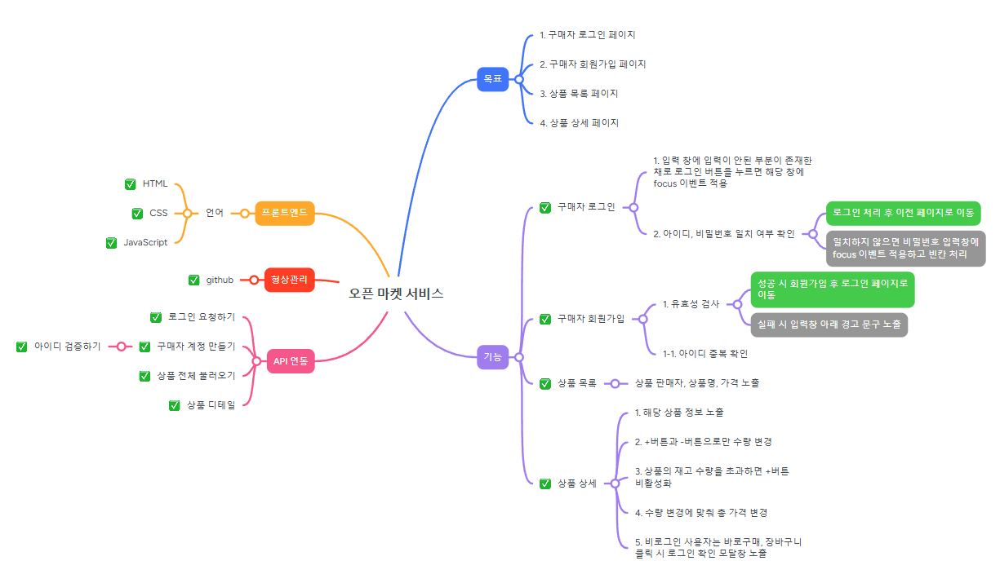
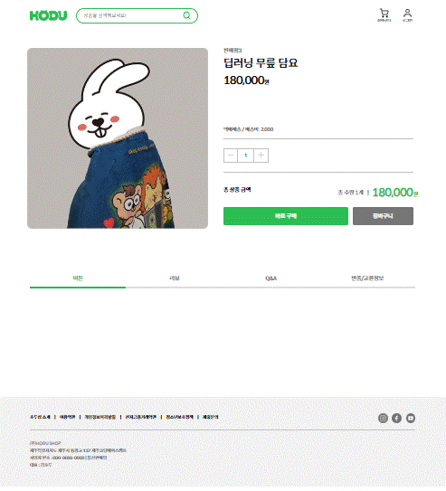
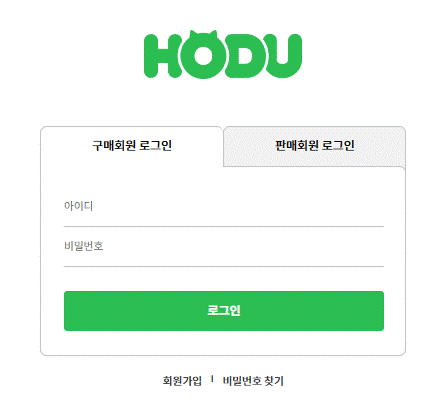
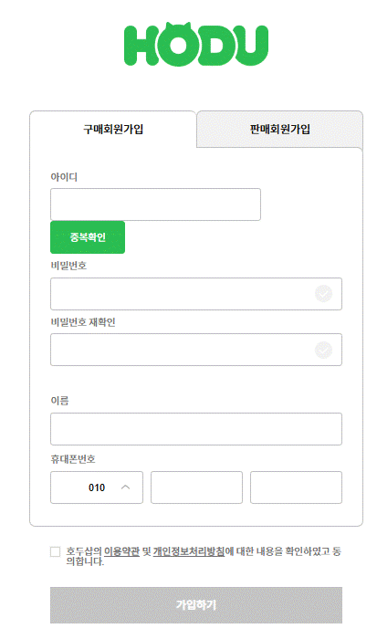
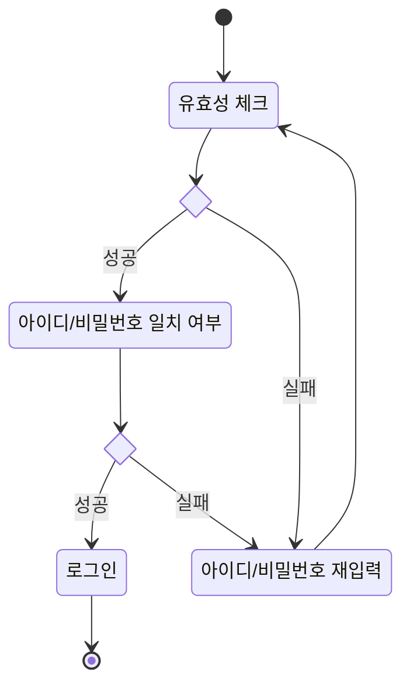
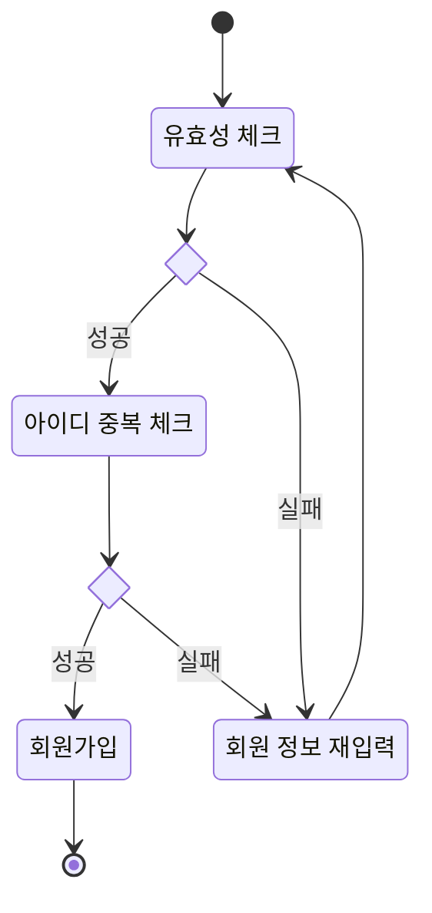
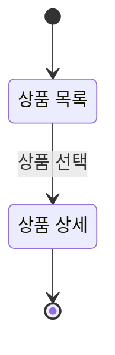
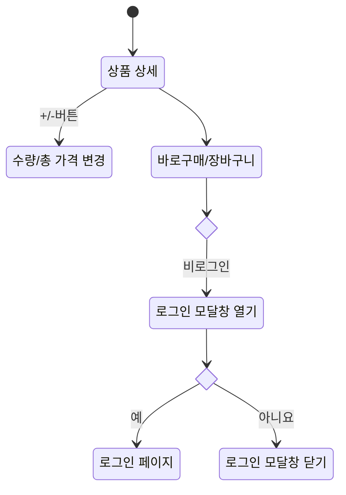

# 오픈 마켓 서비스

## 1. 목표와 기능
### 1.1 목표
- 오픈 마켓 구매자 페이지 구현
  - 구매자 로그인
  - 구매자 회원가입
  - 상품 목록
  - 상품 상세

### 1.2 기능
- 구매자 로그인
  - /accounts/login/ API 연동 -> 아이디, 비밀번호 일치 여부 확인    
- 구매자 회원가입
  - /accounts/validate-username/ API 연동 -> 아이디 중복 확인
  - /accounts/buyer/signup/ API 연동 -> 회원가입
  - 유효성 검사
- 상품 목록
  - /products/ API 연동 -> 상품 목록 가져오기   
- 상품 상세
  - /products/<int:product_id>/ API 연동 -> 상품 상세 가져오기

## 2. 개발 환경
### 2.1 배포 URL
- <https://minerkyi.github.io/open-market/>
- 테스트용 계정
  ```
  id : buyer1
  pw : weniv1234
  ```
  
### 2.2 연동 API
- [API 명세](https://paullabworkspace.notion.site/new-API-ae43c5d6e01a43d895dd31763e70ba38)
- 요청 URL: <https://api.wenivops.co.kr/services/open-market/>

  | URL                          | Note                            |
  |------------------------------|---------------------------------|
  | /accounts/login/             | 로그인 요청하기                   |
  | /accounts/validate-username/ | 아이디 검증하기                   |
  | /accounts/buyer/signup/      | 구매자 계정 만들기                |
  | /products/                   | 상품 전체 불러오기                |
  | /products/<int:product_id>/  | 상품 디테일                      |

## 3. 요구사항 명세와 기능 명세


## 4. 프로젝트 구조
📦open-market  
 ┣ 📂assets // 이미지 파일 모음  
 ┣ 📂css   
 ┃ ┣ 📜app.css  
 ┃ ┣ 📜detail.css  
 ┃ ┣ 📜join.css  
 ┃ ┣ 📜login.css  
 ┃ ┣ 📜product.css  
 ┃ ┗ 📜reset.css  
 ┣ 📂js   
 ┃ ┣ 📜app.js  
 ┃ ┣ 📜common.js  
 ┃ ┣ 📜detail.js  
 ┃ ┣ 📜join.js  
 ┃ ┣ 📜login.js  
 ┃ ┗ 📜product.js  
 ┗ 📜index.html  

 ## 5. 화면 설계
 | 상품 목록  | 상품 상세  |
 |----------|-----------|
 |   |   |
 
 | 로그인  | 회원가입  |
 |----------|-----------|
 |   |   |

## 6. 메인 기능
- 로그인

- 회원가입

- 상품 목록

- 상품 상세

## 7. 개발하며 느낀점
- 
